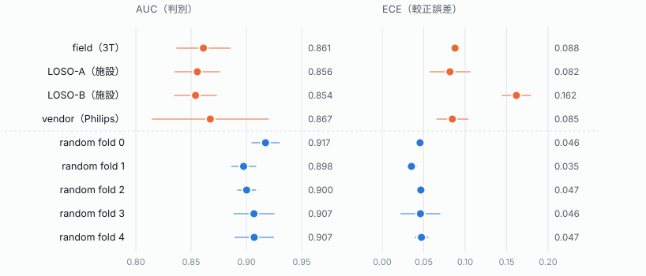
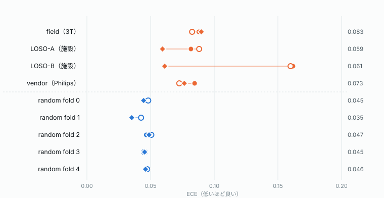
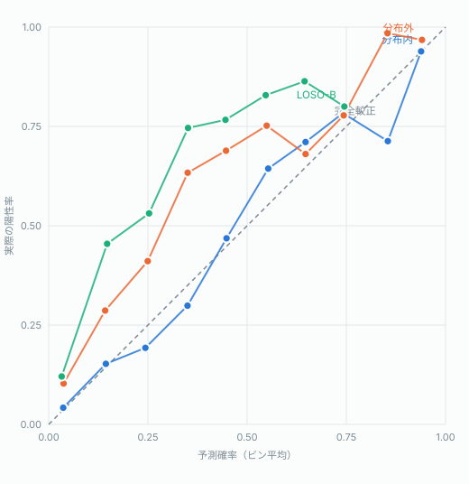
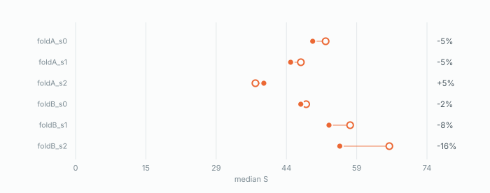
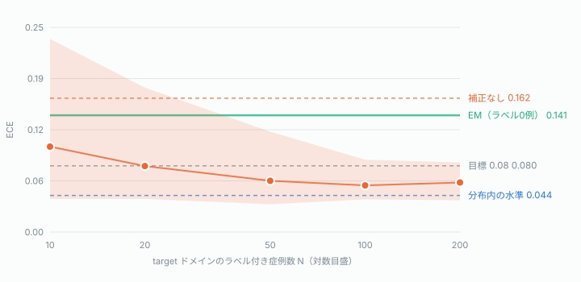
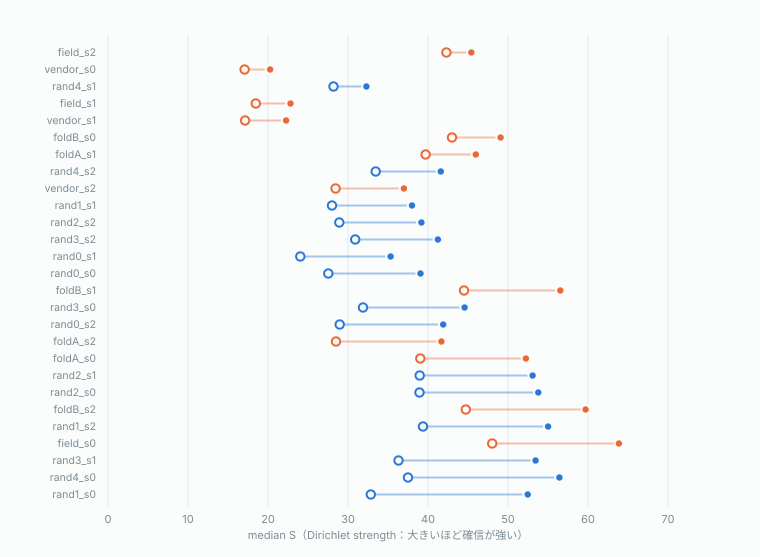
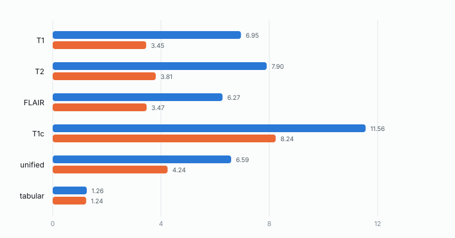
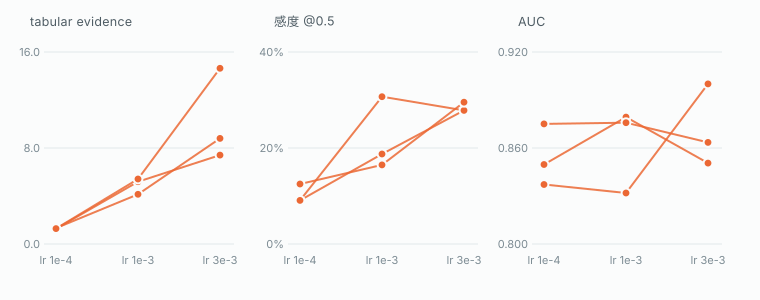
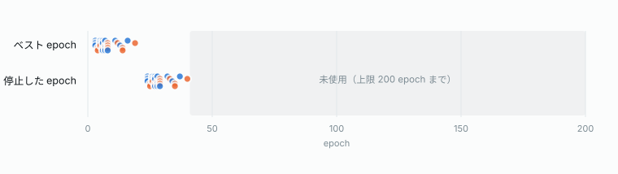

**OpenIDH · Stage B · 全27ラン**

# 判別性能は分布シフトに耐えた。較正は耐えなかった。

> この Markdown は `results/stageb-report.html` から生成しています。図は `results/figures/fig-NN.svg` を参照しており、`results/` ごと配置すれば GitHub などでもそのまま表示されます。PDF が要る場合は HTML 版をブラウザで開き、印刷から「PDF として保存」してください（印刷用のレイアウトを用意してあります）。

グリオーマ IDH 変異予測モデルを、施設・ベンダー・磁場強度という 性質の異なる3種類の分布シフトで評価した結果。AUC の低下は 0.046 にとどまる一方、 期待較正誤差は 2.4 倍に悪化した。

構成: 9 fold-unit × 3 seed = 27 ラン · 実行環境: A100-SXM4-40GB / 1 GPU per job · 不確実性チェック: 27 / 27 合格 · commit: e2d2994

---

- **AUC の低下幅**: −0.046 — 分布外 0.860 ± 0.028 ／ 分布内 0.906 ± 0.014。 AUPRC の差はさらに小さく +0.011。 ✓ 主張は成立
- **ECE の悪化倍率**: 2.4× — 分布外 0.104 ／ 分布内 0.044。 Brier 0.085 → 0.141、NLL 0.287 → 0.452 も同傾向。 ! 要対処
- **不確実性の健全性**: 27/27 — 全ランで「誤答時のほうが確信度が低い」が成立。 evidential 設計の中核が意図どおり機能している。 ✓ 例外なし

---

**所見 — 判別 vs 較正**

## 性質の違う3種類のシフトで、AUC が揃って 0.85〜0.87 に着地した

施設シフト（LOSO-A / LOSO-B）、ベンダーシフト（Philips）、磁場強度シフト（3T）は、 それぞれ異なる要因でデータ分布を動かす。にもかかわらず AUC は **0.854 / 0.856 / 0.861 / 0.867 と 0.013 の幅に収まった**。 偶然では出にくい一貫性で、判別性能の頑健性を裏づける。

ところが同じ図の右パネルを見ると、ECE は分布内の 4 ユニットが 0.035〜0.047 に密集するのに対し、 分布外は 0.082〜0.162 に散る。**順位づけの能力は保たれるが、確信度の目盛りは狂う**—— これが今回の実験の中心的な知見だと考える。とりわけ LOSO-B の ECE 0.162 は、 臨床判断に確率値をそのまま使うことを難しくする水準である。

*図1 — 点は 3 seed の平均、横線は標準偏差。左パネルは高いほど良く、右パネルは低いほど良い。 破線より上が分布外の 4 ユニット。*

---

**所見 — 事後較正**

## temperature scaling は効かなかった。実装ではなく、道具が問題に合っていない

仕様 §10 は inner-val で temperature をフィットして test に当てることを指定していた。 27ラン全てに適用した結果、**分布外の ECE は 0.104 → 0.101 とほぼ動かず、 分布内はむしろ 0.044 → 0.047 と悪化した**。 27ラン中 16 ランで ECE が悪化している。最も較正の悪い LOSO-B も 0.162 → 0.160 で、実質ゼロだった。

原因は **T の平均が 0.992（範囲 0.66〜1.22）** だったことに尽きる。inner-val 上ではモデルは既にほぼ較正されており、temperature は 「補正すべきものが無い」と判断している。これは実装の失敗ではなく、 **道具が問題に構造的に噛み合っていない**ということである。

理由は2つある。第一に、§10 が問題視したのは **base rate のシフト** （LOSO-B: inner-val 11.8% → test 28.4%）だが、**temperature はロジットを定数倍するだけで切片を持たない**。 base rate のずれは切片で吸収すべき量なので、原理的に補正できない。第二に、 **T をフィットする inner-val は train と同分布である**。 シフトした後に生じる較正ずれは、inner-val からは観測できない。

切片が本当に足りていないのかを確かめるため、**test の陽性率を既知と仮定した prior correction をオラクルとして**当てた。LOSO-B なら inner-val 11.8% → test 28.4%、 ロジットに +1.09 を足す操作にあたる。test の陽性率は実運用では分からないので配備はできないが、 **base rate 補正で取り戻せる上限**が測れる。

結果は明快だった。**LOSO-B の ECE は 0.162 → 0.061（62% 減）**、 分布外全体でも 0.104 → 0.072。分布内は 0.044 → 0.044 とほぼ動かない （シフトが無いのだから当然である）。分布内の ECE 0.044 を「較正の下限」とみなして超過分で測ると、 **LOSO-B の較正崩れの 86%、分布外全体では 54% が base rate 由来**ということになる （ロジットで測った場合の割合は次節で併記する）。 効く場所も一貫している——オフセットが大きいユニットほど改善が大きく（LOSO-B +1.09 → 62% 減）、 オフセットがほぼゼロの field 3T では何も起きない。

裏を返せば、**残りは確率の形そのものの歪みであり、base rate 補正では届かない**。 切片を持つ較正（Platt scaling）に広げても埋められるのはこの上限までで、 しかも実運用では test の陽性率を知り得ない以上、そこにも届かない。

したがってこれは「較正手法の実装に失敗した」ではなく、 **「事後較正では分布シフト下の較正ずれを吸収できない」という知見**として読むべきである。 確率値そのものを信頼できない領域が残る以上、**「この予測は信頼できるか」を確率とは別の量で持つ必要がある**。 27ラン全てで成立していた evidential な不確実性（誤答時に S が下がる）は、 まさにその役割を担う量であり、この結果はその必要性を補強している。

*図2 — 3 seed の平均 ECE。右端の数値は3手法のうち最も良い値。色は分布外／分布内、 形が較正手法を示す。*

ECE は1つの数字に潰れてしまうので、**どの確率帯でずれているのかを信頼度図で見た**。 分布内の曲線は対角線にほぼ乗る。分布外は全域で対角線の上、つまり **どの確率帯でも実際の陽性率が予測を上回る（過小評価）**。 LOSO-B は特に顕著で、0.35 と予測した群の実際の陽性率は 0.75 に達する。

重要なのは**そのずれが高確率側に偏っておらず、全域でほぼ一様だ**という点である。 LOSO-B のずれをロジットで測ると **+1.42 ± 0.17** （n≥20 の 7 ビン、予測確率 0.03〜0.64 の範囲）で、 **ビンをまたいでほぼ定数**——これは定数のロジットオフセット、すなわち base rate のずれが 持つ形そのものである。オラクルのオフセット +1.09 とも整合する。 対処としては「高確率側だけを叩く」補正ではなく、全体を平行移動させる補正が要る、ということになる。

*図3 — 予測確率を10ビンに分け、各ビンの平均予測確率（横）と実際の陽性率（縦）を取った。 対角線が完全較正。被験者5例未満のビンは描いていない。ECE は1つの数字に潰れてしまうが、 この図はどの確率帯でずれているかを示す。*

**設計検証 §14.2 — 同一モデル内での in-site / out-site 比較**

ラン間で S を比べると訓練セットの大きさが交絡するので、**同一モデルに in-site データと out-site データを通して比較した**。LOSO なら inner-val が in-site の held-out（LOSO-B なら UCSF + UPenn）、test が out-site（同 UTSW）にあたる。 vendor と field は train・val・test すべて UTSW なので、この対比自体が存在しない。対象は LOSO の6ラン。

結果は out-site 側で median S が平均 **-5%**（5/6 ランで低下、 最大 -16%、 1ランは逆に上昇）。**向きは設計意図どおりだが、効果は弱く seed 間で一貫していない。**

これは同じ S が誤答に対して示す反応と比べると際立つ。**誤答時の S 低下は平均 -24%、 27/27 ランで例外なし**だった。つまりこのモデルの不確実性は **「間違えていること」には強く反応するが、「施設が変わったこと」自体にはほとんど反応しない**。

ただしこれは「検証に失敗した」のではなく、**そもそもその能力を訓練していなかった**と書くのが正確である。 evidential loss が勾配を与えるのは予測の誤りに対してだけで、正則化項が罰するのも誤方向の evidence だけである。 **ドメインが変わっても予測さえ当たっていれば損失は下がらない**。 訓練信号にドメインの情報が一切入っていない以上、ドメイン検知能力が育たないのは道理であり、 −5% という弱い反応はむしろ設計どおりの帰結である。 これは設計上の見落としであり、ドメイン検知を求めるなら 損失かデータ設計の側にその信号を入れる必要がある——不確実性の定式化を変えるだけでは足りない。

*図4 — LOSO の6ラン。右端は out-site の median S が in-site から何%動いたか。*

---

**所見 — 処方箋**

## target 施設の 20 例で、較正はほぼ取り戻せる

ここまでは「事後較正では届かない」という問題提起で終わっている。だが前節の分解が正しいなら、 必要なのは**定数を1つ、target 側で決めること**だけのはずである。 そこで **target 施設のラベル付き症例を N 例だけ使って切片を推定し、残りの症例で ECE を測った**。 N ごとに 50 回のブートストラップを行い、同じ評価集合の上で補正なしの値とも比べている。

LOSO-B の結果は明快で、**N = 20 例で ECE 平均 0.080**、 N = 100 で 0.056、補正なしの 0.162 から大きく下がる。 全例を使った場合の到達点は 0.048 で、**分布内の水準 0.044 とほぼ同じ**である。 LOSO-A でも N = 50 で 0.057（補正なし 0.082）と同じ傾向が出る。

ここで前節の数字が繋がる。**切片を直接あてはめると LOSO-B の較正崩れはほぼ全部消える**—— つまり崩れの正体は**ほぼ純粋な定数ロジットオフセット**である。 一方その定数の大きさは、base rate のずれだけでは説明しきれない。 実測のずれ +1.42 に対し base rate から予測される値は +1.09 で、 **ロジットベースでは 77%、ECE ベースでは 86%** が base rate 由来にあたる。 ECE が非線形な指標なので両者は一致しないが、どちらで測っても主要因が base rate であることは変わらない。 残りは施設が変わったこと自体が動作点をずらした分である。

実務的な読み方はこうなる。**未知の施設に持ち込むとき、その施設のラベル付き症例が数十例あれば 確率値は使える水準に戻る。**ただし 200 例まで増やしても 95% 区間の上端は 0.084 までしか下がらない。 **平均としては届くが、個々の施設で必ず届くとは言えない**—— N が小さいほど推定オフセットのばらつきが大きく（N=10 で ± 0.87、 N=100 で ± 0.32）、外す側に外すと補正が害になり得る。

*図5 — LOSO-B。線は50回×3 seed のブートストラップ平均、帯は95%区間。 横軸は対数目盛。各 N で切片は N 例のみから推定し、ECE は残りの症例で測っている。 vendor と field は base rate のずれがほぼ無いため、この補正では改善しない（前節のとおり）。*

**LOSO-B — N 例で切片を推定したときの ECE**

| N | ECE 平均 | 95% 区間 | 推定オフセット |
|---|---|---|---|
| 10 | 0.103 | 0.040 – 0.233 | +1.33 ± 0.87 |
| 20 | 0.080 | 0.040 – 0.175 | +1.42 ± 0.63 |
| 50 | 0.062 | 0.034 – 0.121 | +1.45 ± 0.41 |
| 100 | 0.056 | 0.040 – 0.087 | +1.49 ± 0.32 |
| 200 | 0.060 | 0.038 – 0.084 | +1.45 ± 0.28 |

---

**所見 — ゼロショットの限界**

## ラベル無しで同じ定数を当てられるか。原理的に当てられない

**仮説** — 較正崩れがほぼ純粋な定数ロジットオフセットなら、 それは**ラベルシフト**——クラス条件付き分布 p(x|y) は動かず、有病率 p(y) だけが動いた—— の兆候かもしれない。もしそうなら推定すべきはスカラー1個で、しかもラベルは要らない。 **EM prior shift（Saerens-Latinne-Decaestecker）は、予測確率の分布の形だけから target の有病率を推定する手法**である。27ラン全てに適用した。

> **EM とは。**Expectation-Maximization（期待値最大化法）。 知りたいパラメータと観測できない変数が絡み合っているとき、片方を仮定してもう片方を更新する、 を交互に繰り返して収束させる一般的な反復法である。ここでは **観測できない変数が「target 施設の各症例の真のラベル」、知りたいパラメータが「target 施設の有病率 π」**にあたる。 E ステップで現在の π のもとに各症例の陽性確率を推定し直し、M ステップでその平均を新しい π とする—— 有病率が分かればラベルの推定が良くなり、ラベルの推定が良くなれば有病率の推定が良くなる、 という相互依存を反復で解く。今回用いたのは事前確率シフト専用の定式化で、 提案者の頭文字から SLD 法（Saerens–Latinne–Decaestecker, 2002）と呼ばれる。 **ラベルを一切使わずに有病率を推定できる**点が、ここで試す動機だった。

**実測** — 外れた。LOSO-B は真の有病率 28.4% に対し EM の推定 **14.6%**、LOSO-A は真値 20.6% に対し **6.6%**——どちらも 14 ポイント近い過小推定である。 当たるオフセットも小さすぎ（LOSO-B で +0.15、必要な値は +1.46）、 LOSO-A では -1.33 と**符号が逆**になる。 分布外の ECE は 0.104 → **0.128 と悪化した**。

**反証の排除** — 実装の誤りでも、サンプル不足でも、数値の不安定でもない。 **27/27 ランで収束した**（発散も振動もなし）。 **分布内では推定が正確**で、真値 18% 前後に対し誤差 0〜3 ポイントに収まる。 **合成データでは回収できる**——p(x|y) を固定して有病率を 12% → 30% に動かした設定では EM は正しく 30% を返す（単体テスト）。 **ラベルなし症例数を増やしても改善しない**：LOSO-B の推定は n=20 で 18.8% ± 15.3、 n=200 で 14.6% ± 4.1 と、ばらつきが縮むだけで**間違った値に精度よく収束する**。 系統誤差であって分散の問題ではない。残るのは仮定の破れだけである。

**原因** — 施設が変われば撮像装置もプロトコルも患者層も変わる。 **p(x|y) 自体が動いており、ラベルシフトの仮定が成立していない。** 決定的な数字はこれである——**LOSO-B の test では予測確率の平均が 12.3%、真の有病率は 28.4%**。 真の有病率が*上がっている*のにモデルの出力は*押し下げられている*。 ラベルシフトなら両者は同じ方向に動くはずで、逆方向に動いた時点で仮定は否定されている。 EM はこの押し下げられた分布を「陽性が少ない証拠」と読み、有病率が下がったと結論する。

**一般化** — 失敗は構造的である。 **EM が使える唯一の信号は、まさにシフトによって歪められた予測確率の分布そのものだ。 歪みを、歪んだものから推定することはできない。** ラベルはこの循環の外にある。前節の N 例曲線が効いた理由と、EM が効かない理由は、同じ構造から出てくる。 **これは SLD というアルゴリズムの出来の問題ではない。** 出力エントロピーの平均を見る手法も、確信度ヒストグラムの形を見る手法も、 読んでいる材料は同じ歪んだ分布である。**アルゴリズムを替えても、 見ている材料が同じなら結果は変わらない。** したがって進む道は「別のゼロショット手法を試す」ではなく、 「ラベルという循環の外にある情報を入れる」しかない。

**結論** — **ゼロショットでの較正回復はこの設定では成立しない。 target 施設の少数ラベルが要る。**上の図で EM の水平線は 0.141 にあり、 ラベル 10 例の点（0.103）にすら届かない。 **ラベル無しの推定は、ラベル 10 例分の価値にも満たない。**

**EM の有病率推定（ラベル不使用、3 seed 平均）**

| ユニット | 訓練時 | 真の値 | EM 推定 | 誤差 | ECE 生 → EM |
|---|---|---|---|---|---|
| field（3T） | 28.2% | 27.2% | 20.5% | -6.6pt | 0.088 → 0.115 |
| LOSO-A（施設） | 16.7% | 20.6% | 6.6% | -14.0pt | 0.082 → 0.141 |
| LOSO-B（施設） | 11.8% | 28.4% | 14.6% | -13.8pt | 0.162 → 0.141 |
| vendor（Philips） | 26.0% | 35.0% | 38.8% | +3.8pt | 0.085 → 0.114 |
| random fold 0 | 18.3% | 18.0% | 21.4% | +3.3pt | 0.046 → 0.079 |
| random fold 1 | 17.9% | 18.0% | 15.9% | -2.2pt | 0.035 → 0.045 |
| random fold 2 | 17.9% | 18.0% | 18.0% | -0.0pt | 0.047 → 0.063 |
| random fold 3 | 18.3% | 17.7% | 15.3% | -2.5pt | 0.046 → 0.045 |
| random fold 4 | 17.6% | 18.3% | 17.0% | -1.4pt | 0.047 → 0.064 |

---

**運用 — いつ補正してよいか**

## 平均の利得だけでは足りない。害を出す確率で決める

N 例曲線が示すのは平均の利得である。だが公開ツールに必要なのはもう一方の数字—— **補正がかえって悪化させる確率**だ。N が小さいとオフセットの推定は荒く、 符号を外せば補正は害になる。EM の LOSO-A がまさにその実例で、 符号を逆に推定して ECE を 0.082 → 0.141 に悪化させた。

そこで各 N について、**補正後の ECE が補正なしを上回った割合**を数えた。 あわせて配備可能な判断基準も評価した——**N 例を復元抽出し直してオフセットを推定し直し、 そのばらつき（SE）の 2 倍を |オフセット| が超えたときだけ補正する**というルールである。 施設が手元に持っている情報だけで判定できる。

**補正が害になる確率と、見送りルールの効果（50回 × 3 seed）**

| ユニット | N | 悪化する確率 | ルール適用後 | 見送り率 | ECE 改善 | 悪化時の幅 |
|---|---|---|---|---|---|---|
| LOSO-B | 10 | 9% | 6% | 70% | +0.072 | 0.035 |
| LOSO-B | 20 | 4% | 3% | 46% | +0.085 | 0.060 |
| LOSO-B | 50 | 0% | 0% | 10% | +0.096 | 0.000 |
| LOSO-B | 100 | 0% | 0% | 1% | +0.105 | 0.000 |
| LOSO-B | 200 | 0% | 0% | 0% | +0.103 | 0.000 |
| LOSO-A | 10 | 46% | 17% | 80% | -0.009 | 0.055 |
| LOSO-A | 20 | 32% | 14% | 76% | +0.009 | 0.046 |
| LOSO-A | 50 | 16% | 10% | 49% | +0.028 | 0.013 |
| LOSO-A | 100 | 7% | 6% | 33% | +0.034 | 0.018 |
| LOSO-A | 200 | 13% | 13% | 9% | +0.030 | 0.017 |

**シフトが大きいユニットでは補正はほぼ安全である。**LOSO-B は N=10 でも悪化率 9%、 N=50 以上では 0% で、改善幅も 0.096 と大きい。 **危ないのはシフトが小さいときだ。**LOSO-A は N=10 で悪化率 46%—— ほぼコイン投げで、期待利得は -0.009 とマイナスである。 補正すべき量が小さいほど、推定誤差が相対的に大きくなるためで、道理ではある。

見送りルールはこの危ない側を守る。LOSO-A の悪化率は N=10 で 46% → 17%、 N=20 で 32% → 14% に下がる。 代償として、シフトが大きいときには過剰に見送る（LOSO-B の N=10 で 70% 見送り、 利得は 0.072 → 0.017 に減る）。 **だが配備時にはどちらの状況にいるか分からない。**取りこぼしより害の回避を優先するのが妥当だと考える。

**ポータルの運用ルール（案）**

- **N < 20**補正しない。確定診断例が 20 例に満たない施設では、 推定オフセットの SE が 1.43 前後あり、期待利得が負になり得る。 確率値は補正なしで提供し、但し書きを添える。
- **20 ≤ N < 50**ルールが発火したときだけ補正する。 |オフセット| がブートストラップ SE の 2 倍を超えない限り適用しない。 この帯では見送りが多数派になる（LOSO-A で 76%）が、それが正しい挙動である。
- **N ≥ 50**補正を既定にし、ルールはガードとして残す。 悪化率は 10% 以下、改善幅は LOSO-B で 0.096。 それでも悪化したときの幅は 0.013 程度で、破滅的ではない。
- **常時**推定オフセットとその SE、および補正の適用可否を画面に出す。 補正が効いているかどうかを利用者が知らないまま確率値を読む状態を作らない。

**補正なしで提供する場合の但し書き（案）**

> この確率値は**他施設のデータで学習したモデル**によるものです。 当施設の IDH 変異頻度が学習データと異なる場合、確率値は**系統的にずれます**。 検証では、真の陽性率が 28.4% の施設で予測確率の平均が 12.3% と低く出ました。 **どの症例がより疑わしいかという順位付けは保たれます**が （AUC は施設が変わっても 0.85〜0.87 を維持）、 **確率値そのものを閾値判断に用いないでください**。 当施設の確定例を 20 例以上登録いただくと、施設ごとの補正が有効になります。

---

**所見 — 不確実性**

## 27ラン全てで、モデルは間違えるときに自信を落としていた

evidential モデルの価値は「当たる」ことではなく「外すときに黙る」ことにある。 その検証として、正答した症例と誤答した症例で Dirichlet strength の中央値を比較した。 **27ラン全てで誤答時のほうが低く、例外はなかった**（差は −3.1 〜 −19.6）。

さらに示唆的なのは vendor（Philips）で、S の絶対値そのものが 20〜37 と他ユニット（40〜60）より明確に低い。 **最も分布の遠いシフトに対して、モデルが自発的に自信を下げている**。 較正が崩れる領域を、不確実性が部分的に補償できている可能性を示す。

*図6 — 1行が1ラン、差の小さい順に並べた。線が必ず左向き（白抜きが左）であることが、 「誤答時に確信度が下がる」の成立を意味する。色は分布外／分布内の別を示す。*

---

**所見 — モダリティ寄与**

## T1c への依存が強く、年齢・性別はほとんど使われていない

ヘッドごとの平均 evidence を見ると **T1c が 11.56 と突出**している。 造影 T1 が IDH 判別に効くこと自体は臨床的に妥当なので、これは説明のつく挙動である。 一方 **tabular（年齢・性別）は 1.26 とほぼ無視されている**。 年齢は IDH 変異の強い予測因子として知られており、意図した設計でないなら検討の余地がある。

vendor（Philips）だけを取り出すと、T1c が 8.24 を保つ一方で T1 / T2 / FLAIR が 3.5 前後まで落ちる。 **ベンダーが変わると T1c 以外のシーケンスから証拠を引き出せなくなっている**。 前処理やコントラスト正規化がベンダー間で揃っていない可能性を示唆する。

*図7 — スケール済み evidence の平均値。値が大きいヘッドほど最終判断への寄与が大きい。*

---

**所見 — シフトに耐える特徴**

## 年齢1変数のロジスティック回帰が、分布外では画像モデルを上回る

EM が失敗したのは、入力がシフトで歪んだ予測分布しかなかったからだった。 年齢はその輪の外にある——**ネットワークを通らないので装置に歪められない**。 そこで訓練サイトで年齢→IDH のロジスティック回帰 π(a) を当て、 target サイトの**年齢分布**を通すことで、ラベル 0 例のまま有病率を推定できるか試した。 その過程で、比較のために年齢だけの識別性能も測った。

結果は予想外だった。**分布外の4ユニット全てで、年齢1変数が 44M パラメータのマルチモーダル画像モデルを上回った** （平均 0.889 対 0.860）。 分布内ではほぼ互角である（0.898 対 0.906）。

**これは「画像に価値がない」という話ではない。**読み方はこうである—— **年齢はシフトで劣化しない（0.898 → 0.889）が、 画像は劣化する（0.906 → 0.860）。** 分布外で順位が入れ替わるのは、年齢が強くなるからではなく画像が弱くなるからだ。 そして両者を足すと常に単独を上回る（分布外 0.910）。 **画像の正味の寄与は、年齢への上乗せ +0.021 として測るのが正確である。**

多くの先行研究は年齢ベースラインを併記していない。 **本研究の立場は、それを報告したうえで上乗せ分を定量化することにある。** 現行モデルはその上乗せを取り出せていない——tabular head の evidence は 1.26、 他ヘッドの 6〜12 に対して一桁小さく、**年齢は実質的に使われていない**。 この点は次節の実験で追った。

*図8 — 右端は「年齢のみ − 画像モデル」。年齢モデルは訓練サイトで当てて test の年齢に適用しており、 target のラベルは使っていない。破線より上が分布外。*

**ゼロショット較正としての年齢**

有病率の推定としては**部分的に成功した**。LOSO-A では有病率シフトの **81%**（2次項を入れると 90%）を説明し、 LOSO-B では **46%** にとどまる。 LOSO-B が伸びないのは年齢のせいではない——**train に含まれる UPenn が GBM 限定コホートで 変異率 3.1%** であり、これはグレード構成であって年齢ではないからだ。

より根本的な限界がある。**UCSF と UTSW の年齢分布は統計的に区別できない** （KS D=0.053, p=0.41）のに、有病率は 20.6% と 28.4% で 7.9 ポイント違う。 年齢帯を揃えても差は残る（50代で 8.2% 対 19.2%）。 **年齢で説明できない有病率差が実在する**ということであり、 外部疫学データ（CBTRUS 等）で π(a) を置き換えても、 ボトルネックは π(a) の精度ではないので**改善は限定的だと考える**。

それでも **EM とは対照的にフェイルセーフである。** EM は符号を外して ECE を悪化させたが、年齢ベース補正は **年齢で説明できる分しか動かないので方向を間違えない**。 適用にあたっては、**target サイトの年齢分布が訓練サイトと有意に違うことを KS 検定で確認してから当てる**のが妥当である（違わなければ動かす理由がない）。 ただしこの手法は**年齢×IDH 関係のサイト不変性に依存する**。 米国3施設では成立したが、小児例や他地域では別途検証が要る。

**年齢のみ vs 画像モデル（test、3 seed 平均）**

| ユニット | 条件 | 年齢のみ | 画像モデル | 画像+年齢 | 差 |
|---|---|---|---|---|---|
| LOSO-A（施設） | 分布外 | 0.904 | 0.856 | 0.919 | +0.049 |
| LOSO-B（施設） | 分布外 | 0.880 | 0.854 | 0.907 | +0.026 |
| vendor（Philips） | 分布外 | 0.905 | 0.867 | 0.920 | +0.038 |
| field（3T） | 分布外 | 0.868 | 0.861 | 0.896 | +0.007 |
| random fold 0 | 分布内 | 0.877 | 0.917 | 0.928 | -0.040 |
| random fold 1 | 分布内 | 0.891 | 0.898 | 0.911 | -0.006 |
| random fold 2 | 分布内 | 0.889 | 0.900 | 0.920 | -0.012 |
| random fold 3 | 分布内 | 0.926 | 0.907 | 0.955 | +0.019 |
| random fold 4 | 分布内 | 0.907 | 0.907 | 0.936 | +0.000 |

---

**実験 — ヘッドの学習率**

## 年齢が使われていなかったのは学習率のせいだった。ただし治ったのは感度だけ

tabular head は 4,482 パラメータ、evidence heads を合わせても 8,332 で、 **44M の事前学習済み trunk と同じ学習率で回っていた**。仮説は単純な学習不足である。 optimizer を trunk と head に分け、head だけ 10倍・30倍にして LOSO-B × 3 seed で確かめた。

**狙った量は動いた。**tabular evidence は 1.29 → 4.92 → 10.28 と単調に増え、3 seed とも同方向である。独立な確認も取れた—— inner-val でヘッド別の重みを最尤推定すると、**変更前は「tabular を 7〜20倍にせよ」だったのが、 3e-3 の後は「≈0.9、そのままでよい」に変わる**。音量が適正になったということだ。

**閾値 0.5 での感度も一貫して改善した。** 10.2% → 28.4%、 seed 別の変化は +18.7 / +18.7 / +17.0 ポイントで、 **3 seed とも +17〜19pt に収まる**。特異度の低下は 0.8pt のみ。 誤答時 S < 正答時 S も全設定で 3/3 維持された。

**しかし AUC は動いたと言えない。**平均は 0.854 → 0.871 と +0.017 だが、 seed 別の変化は +0.001 / -0.012 / +0.063 と符号が揃わず、 **設定内の seed 間 sd 0.026 のほうが平均効果より大きい**。 平均を押し上げているのは1 seed だけである。**n=3 では AUC への効果は検出できない。**

順位が動かず確率の位置だけが動いたのは筋が通っている。 tabular head を大きくすることは**融合ロジット全体を平行移動させる効果が主で、 順位の入れ替えは副次的**だからだ。言い換えれば、 **この介入は「学習によって内部化された切片補正」**であり、 前節の年齢ベース切片補正と同じ方向の効果を、後付けではなくモデルの中で実現している。

*図9 — 線が1 seed。左と中央は3本とも同じ向きに動くが、右（AUC）は揃わない。 これが「効いた指標」と「判定できない指標」の違いである。*

**LOSO-B、seed 別（左から tabular evidence / AUC / 感度@0.5）**

| 設定 | ev s0 | ev s1 | ev s2 | AUC s0 | AUC s1 | AUC s2 | 感度 s0 | 感度 s1 | 感度 s2 |
|---|---|---|---|---|---|---|---|---|---|
| lr 1e-4（既定） | 1.33 | 1.27 | 1.29 | 0.850 | 0.875 | 0.837 | 9.1% | 9.1% | 12.5% |
| lr 1e-3 | 4.14 | 5.19 | 5.42 | 0.879 | 0.876 | 0.832 | 18.8% | 30.7% | 16.5% |
| lr 3e-3 | 8.80 | 7.41 | 14.64 | 0.851 | 0.863 | 0.900 | 27.8% | 27.8% | 29.5% |

**未解決**

個別シーケンスのヘッド（T1 / T2 / FLAIR）は単独 AUC 0.53〜0.72 と弱く、 inner-val で重みを学習させると**ほぼ全ランで下限に張り付く**—— 最適化はこれらを捨てたがっている。それでも evidence を 10 前後ずつ出し続けており、 強いヘッドを希釈している。**AUC の残差はここにある可能性が高い。** 次の判断は、(1) seed を増やして AUC への効果の有無を確定させるか、 (2) 個別シーケンスヘッドの整理に進むか、である。

---

**所見 — 学習の実態**

## 200 epoch を用意したが、実際に使われたのは平均 8 epoch だった

全27ランが **24〜40 epoch で早期終了**し、上限の 200 epoch に到達したランは一つもない。 ベスト epoch は最小 3 / 最大 19 / 平均 8.0。 907〜1046 症例に対して ViT-small×2 trunk（44M パラメータ）という構成なので、 過学習が速いこと自体は道理である。

ただし **実質 10 epoch 未満しか学習に使えていない**という事実は、 学習率・正則化・データ拡張を見直せばまだ伸びしろがあることを示す。 また計算資源の観点では、24時間のウォールタイム制限に対して実際の所要は 1 ラン約1時間で、 制限が問題になる場面ではなかった。

*図10 — 点が1ラン（見やすさのため上下に散らしている）。網掛けは一度も使われなかった epoch 範囲。*

---

**データ**

## 数表

**ユニット別サマリ（3 seed の平均 ± 標準偏差）**

| ユニット | 条件 | n(test) | AUC | AUPRC | ECE | Brier |
|---|---|---|---|---|---|---|
| field（3T） | 分布外 | 195 | 0.861 ± 0.024 | 0.757 ± 0.051 | 0.088 ± 0.004 | 0.122 ± 0.013 |
| LOSO-A（施設） | 分布外 | 501 | 0.856 ± 0.021 | 0.657 ± 0.023 | 0.082 ± 0.025 | 0.122 ± 0.011 |
| LOSO-B（施設） | 分布外 | 619 | 0.854 ± 0.019 | 0.694 ± 0.034 | 0.162 ± 0.018 | 0.177 ± 0.007 |
| vendor（Philips） | 分布外 | 140 | 0.867 ± 0.053 | 0.802 ± 0.060 | 0.085 ± 0.019 | 0.141 ± 0.028 |
| random fold 0 | 分布内 | 327 | 0.917 ± 0.013 | 0.767 ± 0.033 | 0.046 ± 0.005 | 0.082 ± 0.009 |
| random fold 1 | 分布内 | 327 | 0.898 ± 0.011 | 0.724 ± 0.029 | 0.035 ± 0.006 | 0.088 ± 0.005 |
| random fold 2 | 分布内 | 327 | 0.900 ± 0.009 | 0.705 ± 0.057 | 0.047 ± 0.004 | 0.089 ± 0.006 |
| random fold 3 | 分布内 | 327 | 0.907 ± 0.019 | 0.730 ± 0.040 | 0.046 ± 0.024 | 0.086 ± 0.007 |
| random fold 4 | 分布内 | 327 | 0.907 ± 0.018 | 0.762 ± 0.030 | 0.047 ± 0.008 | 0.082 ± 0.008 |

**全27ランの生データを開く**

**全27ランの生データ**

| ラン | seed | n(test) | AUC | AUPRC | ECE | Brier | NLL | S 正答 | S 誤答 | ベスト | 停止 | reg/data |
|---|---|---|---|---|---|---|---|---|---|---|---|---|
| field_s0 | 0 | 195 | 0.846 | 0.698 | 0.092 | 0.136 | 0.462 | 63.859 | 48.024 | 19 | 40 | 7.098 |
| field_s1 | 1 | 195 | 0.889 | 0.790 | 0.084 | 0.112 | 0.364 | 22.815 | 18.477 | 4 | 25 | 5.348 |
| field_s2 | 2 | 195 | 0.848 | 0.784 | 0.087 | 0.118 | 0.397 | 45.412 | 42.304 | 14 | 35 | 7.708 |
| foldA_s0 | 0 | 501 | 0.853 | 0.656 | 0.108 | 0.132 | 0.438 | 52.238 | 39.033 | 8 | 29 | 4.916 |
| foldA_s1 | 1 | 501 | 0.877 | 0.681 | 0.060 | 0.111 | 0.356 | 45.973 | 39.699 | 8 | 29 | 6.850 |
| foldA_s2 | 2 | 501 | 0.836 | 0.634 | 0.077 | 0.123 | 0.406 | 41.679 | 28.504 | 8 | 29 | 5.070 |
| foldB_s0 | 0 | 619 | 0.850 | 0.671 | 0.141 | 0.170 | 0.527 | 49.079 | 43.001 | 6 | 27 | 5.615 |
| foldB_s1 | 1 | 619 | 0.875 | 0.733 | 0.172 | 0.178 | 0.550 | 56.537 | 44.502 | 7 | 28 | 5.026 |
| foldB_s2 | 2 | 619 | 0.837 | 0.678 | 0.172 | 0.183 | 0.599 | 59.699 | 44.726 | 12 | 33 | 4.809 |
| rand0_s0 | 0 | 327 | 0.931 | 0.804 | 0.050 | 0.071 | 0.248 | 39.058 | 27.540 | 6 | 27 | 7.769 |
| rand0_s1 | 1 | 327 | 0.914 | 0.741 | 0.040 | 0.088 | 0.288 | 35.321 | 24.043 | 3 | 24 | 5.232 |
| rand0_s2 | 2 | 327 | 0.907 | 0.758 | 0.047 | 0.086 | 0.287 | 41.895 | 28.962 | 6 | 27 | 6.356 |
| rand1_s0 | 0 | 327 | 0.885 | 0.691 | 0.042 | 0.093 | 0.314 | 52.458 | 32.844 | 7 | 28 | 6.356 |
| rand1_s1 | 1 | 327 | 0.904 | 0.741 | 0.030 | 0.087 | 0.292 | 37.994 | 27.994 | 5 | 26 | 5.376 |
| rand1_s2 | 2 | 327 | 0.904 | 0.741 | 0.033 | 0.084 | 0.282 | 55.007 | 39.373 | 16 | 37 | 8.956 |
| rand2_s0 | 0 | 327 | 0.900 | 0.763 | 0.049 | 0.082 | 0.285 | 53.788 | 38.942 | 11 | 32 | 6.486 |
| rand2_s1 | 1 | 327 | 0.892 | 0.650 | 0.048 | 0.093 | 0.310 | 53.069 | 38.968 | 13 | 34 | 8.044 |
| rand2_s2 | 2 | 327 | 0.909 | 0.702 | 0.042 | 0.091 | 0.294 | 39.181 | 28.909 | 5 | 26 | 5.758 |
| rand3_s0 | 0 | 327 | 0.886 | 0.685 | 0.041 | 0.093 | 0.314 | 44.576 | 31.873 | 7 | 28 | 5.515 |
| rand3_s1 | 1 | 327 | 0.914 | 0.744 | 0.025 | 0.080 | 0.269 | 53.452 | 36.314 | 8 | 29 | 6.702 |
| rand3_s2 | 2 | 327 | 0.921 | 0.762 | 0.072 | 0.084 | 0.280 | 41.232 | 30.902 | 3 | 24 | 7.989 |
| rand4_s0 | 0 | 327 | 0.898 | 0.732 | 0.042 | 0.089 | 0.301 | 56.425 | 37.503 | 7 | 28 | 6.576 |
| rand4_s1 | 1 | 327 | 0.895 | 0.764 | 0.057 | 0.083 | 0.290 | 32.297 | 28.182 | 3 | 24 | 6.605 |
| rand4_s2 | 2 | 327 | 0.928 | 0.791 | 0.044 | 0.073 | 0.255 | 41.597 | 33.463 | 6 | 27 | 6.855 |
| vendor_s0 | 0 | 140 | 0.889 | 0.829 | 0.072 | 0.129 | 0.406 | 20.262 | 17.071 | 5 | 26 | 4.734 |
| vendor_s1 | 1 | 140 | 0.906 | 0.843 | 0.075 | 0.123 | 0.389 | 22.261 | 17.143 | 4 | 25 | 5.248 |
| vendor_s2 | 2 | 140 | 0.807 | 0.733 | 0.107 | 0.173 | 0.537 | 36.983 | 28.449 | 14 | 35 | 4.981 |

---

**出典・注記**

- 集計元：runs/*/{result,calibration}.json と runs/*/predictions.csv（27ラン）
- 再現：aggregate_results.py（数表）→ calibrate_runs.py（較正・要チェックポイント）→ sample_size_curve.py / em_prior_shift_eval.py / correction_policy.py → build_report.py（この頁）→ report_to_markdown.py（Markdown 版）
- 各 fold の test セットは仕様どおり1回だけ評価している。± は 3 seed の標本標準偏差であり、症例レベルの信頼区間ではない。 ブートストラップの区間は、症例の再抽出による分散であって施設間のばらつきではない。
- 較正の補正はいずれも単調変換なので、AUC・AUPRC は全27ランで変化しない（最大変化量 0.00e+00）。
